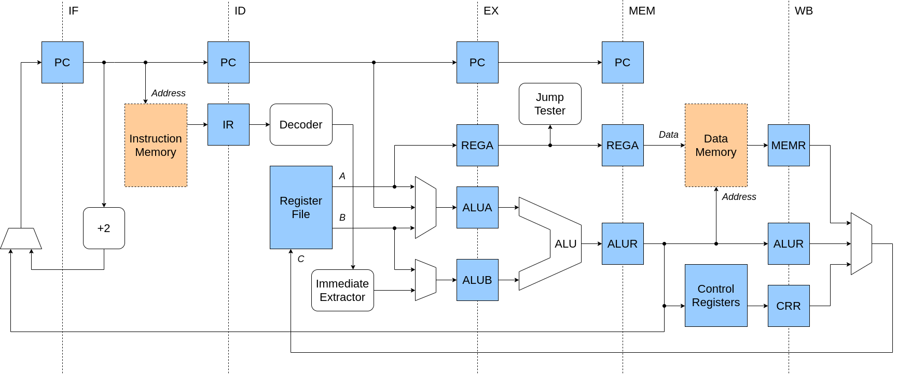

# RISC63



[](https://github.com/dominiksalvet/risc63/actions)
[](https://github.com/RichardLitt/standard-readme)
[](https://hits.seeyoufarm.com)

> Custom 64-bit pipelined RISC processor

RISC63 is a **purely 64-bit RISC processor** with classic five stage pipelining described in VHDL. Originally, it was developed as a prototype of more advanced RISC64 architecture, which was discontinued later. Nevertheless, RISC63 represents a full-fledged processor, designed in a simple manner. Convince yourself – look around.

The main motivation behind RISC63 was to examine the impacts of smaller instruction words in the processor design and its architecture. Based on that, the following features indicate that RISC63 is an unconventional processor, which has something to offer:

* All instructions are 16 bits wide
* 16 x 64-bit general purpose registers
* Efficient PC-relative addressing
* Interrupts are always accepted instantly
* All pipeline hazards are eliminated in hardware

> Did you know that RISC63 was used within [my bachelor thesis](https://github.com/dominiksalvet/bachelor-thesis) (Czech only)?

## Table of Contents

* [Simulation](#simulation)
  * [Dependencies](#dependencies)
  * [Usage](#usage)
* [Programming](#programming)
* [Questions](#questions)
* [Contributing](#contributing)
* [License](#license)

## Simulation

A custom build system has been created during the RISC63 development to ease processor building and simulation. If you want to **see the RISC63 processor running**, that build system will easily get you through. Whatever you need is just one command away – that was its original idea.

### Dependencies

All you need to bring RISC63 to life is stated here:

* [GHDL](https://github.com/ghdl/ghdl)
* [GTKWave](https://github.com/gtkwave/gtkwave) (optional)

### Usage

First prepare a local copy of this repository:

1. `git clone https://github.com/dominiksalvet/risc63.git`
2. `cd risc63/build`

In `build` directory, there is a POSIX `makefile`, which represents the RISC63 build system. Provided that your current working directory is `build`, you can run `make` command with the following targets:

* `elab` - elaborate all VHDL entities
* `test` - run tests of all test bench entities
* `elab_a` - elaborate the entity, whose name is stored in macro `a`
* `test_a` - run the test of a given entity
* `view_a` - run the test of a given entity and display its waves
* `clean` - remove all generated files

## Programming

If you are brave enough, you can try to **write a program for this processor**. Currently, the only supported programming language is the processor's machine code. Furthermore, you need to modify an existing test bench file to make it work. However, once you do so, processors will never be big magic for you again.

Do not worry, you do not have to start from scratch. There is an example program already prepared in `test/risc63_tb.vhdl` file and it contains potential assembly mnemonics in comments. You may replace the example program with yours. Then you need to replace `drive_input` and `check_output` processes (below in the same file) with the following process:

```vhdl
run_risc63: process
begin
    i_rst <= '1';
    i_irq <= '0';
    wait for c_CLK_PERIOD;

    i_rst <= '0';
    -- increase 64 to extend simulation time
    wait for 64 * c_CLK_PERIOD;

    v_done := true; wait;
end process run_risc63;
```

The last step is to run the simulation with your program. To do so, change the current directory to `build` and run `make view_a a=risc63_tb`. This will run the processor simulation and open GTKWave with its waves. Do not forget to import all required signals from the SST view to actually see their changes in time.

> For more information about RISC63 architecture, have a look at the [documentation](doc).

## Questions

If you have any questions, you can find out how to get them answered in [support.md](support.md) file.

## Contributing

Do you want to contribute somehow? Then [contributing.md](contributing.md) file is here for you.

## License

RISC63 is licensed under the [Apache License 2.0](license).
